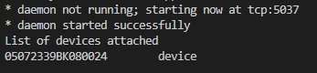
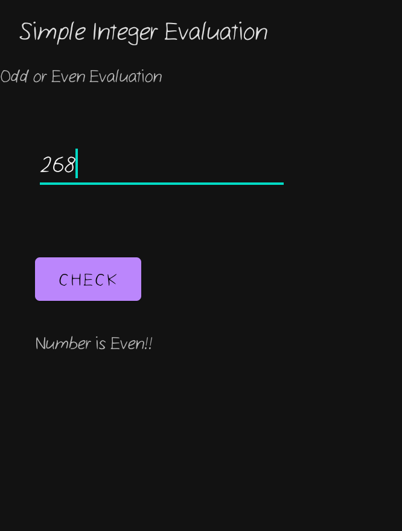
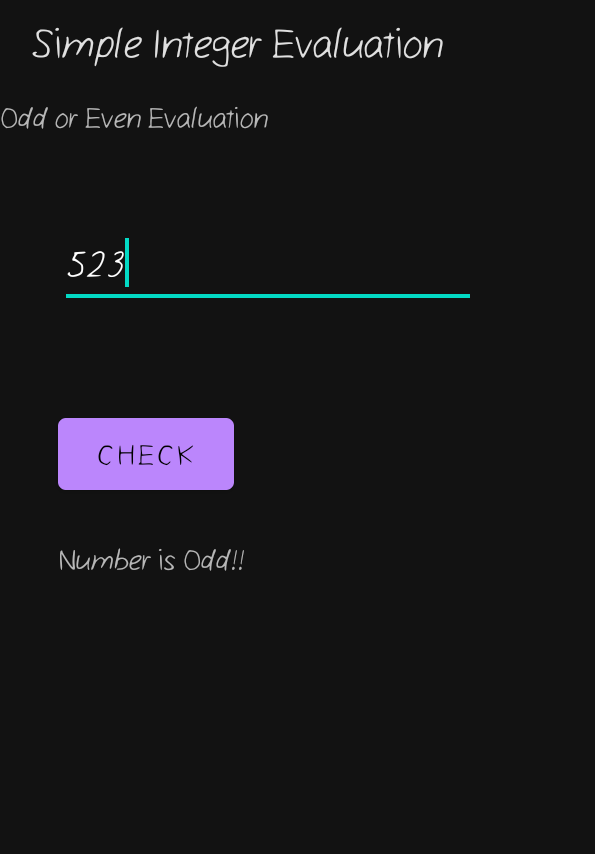

# Android-App-Dev
A simple-interger-evaluation program using Java

## Prerequisites

Make sure you have have Java jdk 11 installed and Android Studio.
Android Studio is available at :

    https://developer.android.com/studio/?gclid=Cj0KCQiAjJOQBhCkARIsAEKMtO3zEhdK4_I0CEZic3UH4dl-9gVXuHFR9dCl3TOHKjmv3xWLU3UxfhYaApfAEALw_wcB&gclsrc=aw.ds.

Detailed Instructions: 

    https://developer.android.com/codelabs/basic-android-kotlin-compose-install-android-studio#2

Import the project in Android studio and build the project.

To view connected devices, open terminal on windows and type the following command:

        adb devices

If you have any connected device, the result should be something like:

After a successful build you app should look like:

